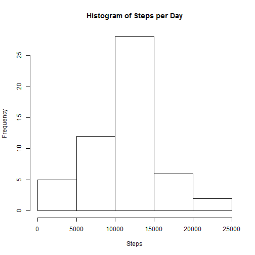
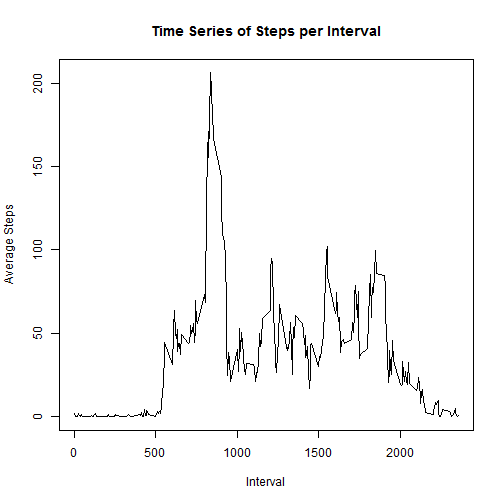
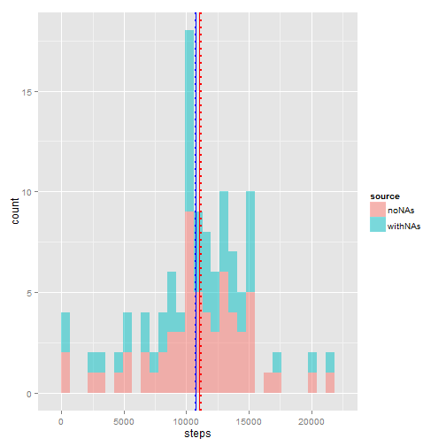
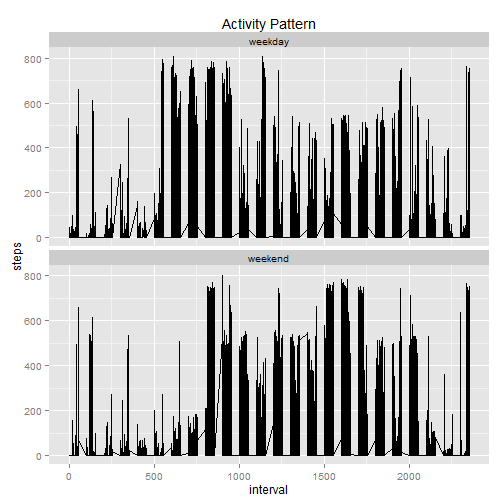

Loading the Assignment dataset into R


```r
activity <- read.csv("activity.csv")
str(activity)
```

```
## 'data.frame':	17568 obs. of  3 variables:
##  $ steps   : int  NA NA NA NA NA NA NA NA NA NA ...
##  $ date    : Factor w/ 61 levels "2012-10-01","2012-10-02",..: 1 1 1 1 1 1 1 1 1 1 ...
##  $ interval: int  0 5 10 15 20 25 30 35 40 45 ...
```

```r
summary(activity)
```

```
##      steps                date          interval     
##  Min.   :  0.00   2012-10-01:  288   Min.   :   0.0  
##  1st Qu.:  0.00   2012-10-02:  288   1st Qu.: 588.8  
##  Median :  0.00   2012-10-03:  288   Median :1177.5  
##  Mean   : 37.38   2012-10-04:  288   Mean   :1177.5  
##  3rd Qu.: 12.00   2012-10-05:  288   3rd Qu.:1766.2  
##  Max.   :806.00   2012-10-06:  288   Max.   :2355.0  
##  NA's   :2304     (Other)   :15840
```


**What is mean total number of steps taken per day?**

*1.Calculate the total number of steps taken per day*


```r
act2 <- aggregate(. ~ date, data = activity, FUN=sum)
```

*2. Make a histogram of the total number of steps taken each day*

 

*3. Calculate and report the mean and median of the total number of steps taken per day*


```r
mean(act2$steps)
```

```
## [1] 10766.19
```

```r
median(act2$steps)
```

```
## [1] 10765
```

**What is the average daily activity pattern?**


```r
act3 <- aggregate(. ~ interval, data = activity, FUN=mean)
```

*Series Plot showing the avergae daily activity pattern*

 

*Which 5-minute interval, on average across all the days in the dataset, contains the maximum number of steps?*


```r
act4 <- subset(act3, select= -date)
act4[which.max(act4$steps),]
```

```
##     interval    steps
## 104      835 206.1698
```


**Imputing missing values**


```r
sum(is.na(activity))
```

```
## [1] 2304
```


```r
if (!require(mice)) {
  install.packages("mice", repos="http://cran.rstudio.com/bin/windows/contrib/3.2/mice_2.22.zip") 
  require(mice)
  library("Rcpp")
  library("lattice")
  library("mice")
}
```


*Make a histogram of the total number of steps taken each day*


```r
impute2 <- aggregate(. ~ date, data = imputed, FUN=sum)

hist(impute2$steps, xlab="Steps", main="Histogram of Steps per Day")
```

 

*Calculate and report the mean and median total number of steps taken per day, which include imputed values*


```r
mean(impute2$steps)
```

```
## [1] 11015
```

```r
median(impute2$steps)
```

```
## [1] 11162
```

**What is the impact of imputing missing data on the estimates of the total daily number of steps?**


```r
if (!require(ggplot2)) {
    install.packages("ggplot2", repos="http://cran.us.r-project.org")
    require(ggplot2)
}
library(ggplot2)
set.seed(800)

act2$source <- 'withNAs'
impute2$source <- 'noNAs'
dat <- rbind(act2, impute2)
```
  
  In the histogram shown below, the blue lines represent the mean (solid) and median (dotted) of the dataset withNAs and the red lines represent the dataset noNAs. There was a slight increase on the values when the NAs were imputed using the MICE(Multivariate Imputation by Chained Equations) Package in R.
 
 

```r
 ggplot(dat, aes(steps, fill=source)) + geom_histogram( alpha=0.5 ) +
  geom_vline(aes(xintercept=mean(steps)), data=act2, color="blue") +
  geom_vline(aes(xintercept=mean(steps)), data=impute2, color="red") +
  geom_vline(aes(xintercept=median(steps)), data=act2, color="blue", 
             linetype="dotted", size=1) +
  geom_vline(aes(xintercept=median(steps)), data=impute2, color="red", 
             linetype="dotted", size=1)
```

 

  


Again for purposes of comparison mean(with NAs) = 1.0766 &times; 10<sup>4</sup> while mean(no NAs) = 1.1015 &times; 10<sup>4</sup>. On the other hand, median(with NAs) = 1.0765 &times; 10<sup>4</sup> while median(no NAs) = 1.1162 &times; 10<sup>4</sup>


**Are there differences in activity patterns between weekdays and weekends?**

*The time series plot below shows the activity patterns between a weekday and weekend activity.*

 


